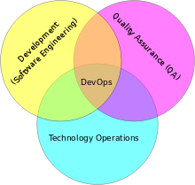

# DevOps是什么？

DevOps是一组过程、方法与系统的统称，用于促进开发、技术运营和质量保障部门之间的沟通、协作与整合。

**wiki上说：**
> DevOps（英文Development和Operations的组合）代表一种文化、运动或实践。旨在促进软件交付和基础设施变更软件开发人员（Dev）和IT运维技术人员（Ops）之间的合作和沟通。它的目的是构建一种文化和环境使构建，测试，发布软件更加快捷，频繁和可靠   

**如图**   

# 我对DevOps的理解

虽然阅读DevOps相关资料知道，DevOps并不是一个人，一个职位；而是一种组织方式，团队协作的一种文化。但是我觉得DevOps其实就是解决**人之间的问题**，特别是在项目研发中，不同职责不同功能人员之间协作的方式和文化。

在一个项目从设计到研发，在到测试到最后项目上线，中间会遇到许许多多的问题。这些问题有简单有复杂，特别是当项目开发到中期后期时对团队中各个职责的配合要求很高，只有在团队精密协作的基础上才能很好地解决这些问题。但是就目前团队协作中出现很多问题：当项目出现问题时，开发，测试，运维都只是在想方设法证明这个问题不是在我这里！就像踢皮球，并没有想一个正真的团队一样团结在一起。

那么如何解决这个问题？不能要求所有的成员都能解决任何问题，因为基于角色的分工，每个人都是做自己最为拿手的工作，我们不能要求团队中的每个人都会所有的东东，都能搞定所有的问题！这个时候我们需要的是一个知识面广，懂得组织和分配成员进行积极的，协作的处理方式。这样的角色应该在问题出现时协调，分配和组织成员协调作战，而不是只有一两个成员着急要死，其他成员却无所事事，完全脱离了团队作战。

那么什么样的人时候做？当然是项目Leader，作为一个项目Leader首先需要拥有广泛的知识面，其次需要能合理的分配任务和组织成员协作，最后在问题时刻，能够挽起袖子带领成员进行问题解决（这就是说项目的Leader需要真正了解，跟进这个项目，而不只是甩手掌柜）。

项目Leader可以作为一个正真的DevOps，而想要做的更好，需要让DevOps被成员接受，举例：这里列举一个PHP项目开发团队，在团队中，PHP工程师应该肩负起DevOps的责任，应该培养起全面的知识体系：前端+PHP+数据库+服务器；这并不是说所有的工作都需要PHP工程师来完成，只是要求作为一个DevOps，需要在问题出现时可以肩负起责任，做好问题点判断，分配和组织相关人员来协助解决问题。说到这里就要说明：在开发中或问题解决中，需要DevOps作为主要责任人进行组织，而相关人员需要积极配合。

当然，最好的方式就是每一个团队成员都有这种广泛的知识面，能够了解和排查可能不属于自己范围内的一些问题点。这样在问题出现时，每一个成员都在积极查找问题出在了那里，不至于出现“踢皮球”。当然，无法保证或者要求每个成员都能有很高的职业素养，这是就需要确定协作中以谁为主？ 上面已经建议了可以以后端程序员为主，其他成员积极协助的形式。

责任应该和权力对等，这样才能使责任者正真负起责任！作为团队领导要给予DevOps更多权力和利益，比如项目奖金等。

# DevOps 读书笔记

## 故障排除

* 划分问题空间，在遇到问题时首先应该通过：二分法，缩小和确定问题范围。当遇到一个问题时，应该思考通过怎样测试排除问题不属于那个范围，然后再重复测试缩小问题范围直至确定问题点。
* 了解改动，通过在问题是不是由于某些新的代码加入时出现，确定问题关联代码，这样一下子就能缩小问题点。
* 大胆和谨慎使用Internet，在出现一些无法解决的问题时，可以大胆的，积极的求助网络，你所遇见的很多问题都是其他人已经遇见过的。谨慎使用，是要求你在使用网上提供的解决方法前，对问题有全面，深刻的认识，确认网上的解决方法是和你的问题相似的，否则网络上各种真真假假的方法很可能会影响你解决问题，甚至产生更多问题。
* 记录问题和解决方案，在每一次成功解决问题以后，应该想尽一切办法抽出时间，让参与问题解决的成员进行问题梳理，原因分析，记录解决方案，然后归档保存以备下次使用。虽然整理文档是让人烦得事情，但是全拼记忆是不靠谱的，而且团队人员是会变化的，所以文档整理完全是值得的。
* 尝试过去的解决方案，也许这次遇到的问题在以前遇到过，而刚好你又像上面所说的进行了整理，那就不要犹豫，找出上次解决方案去试试这次问题的解决。

## 服务器状态监测

* uptime - 查看系统负载: `load averages: 1.67 1.50 1.44` 分别表示：1，5，15分钟系统平均负载     

* top - 动态查看系统负载        

* iostat - 报告系统存储 I/O     

# 相关资料

* [What Is (Not) DevOps, and How Do We Get There?](http://www.infoq.com/news/2014/03/devops)

* 